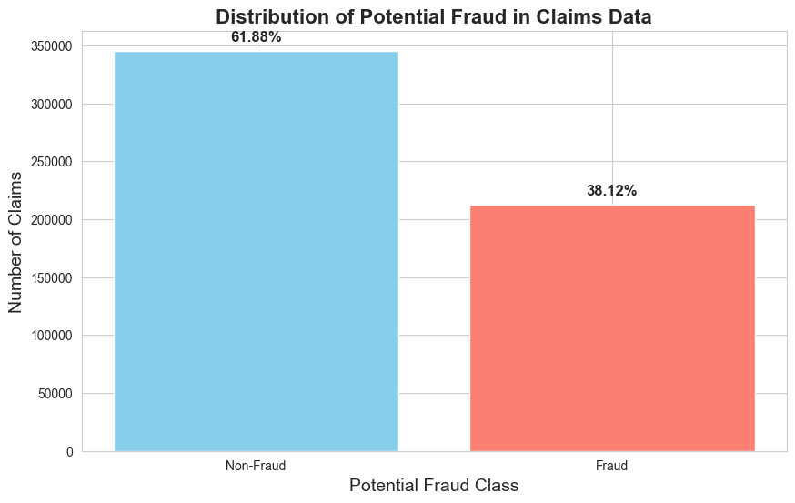
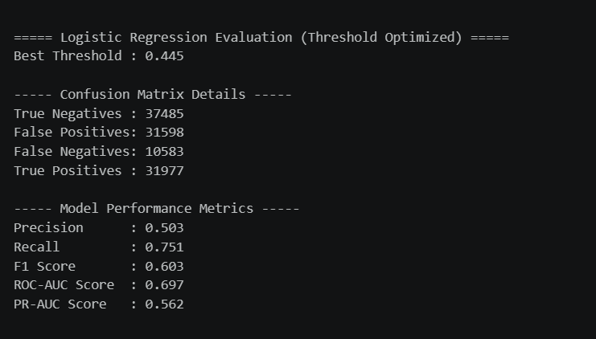
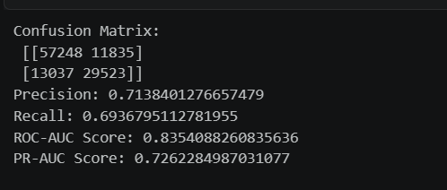
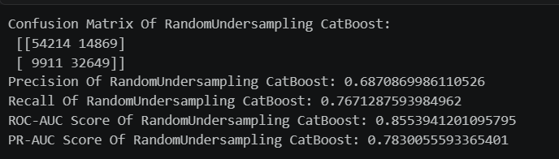
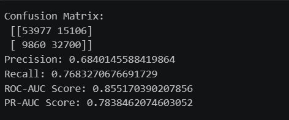

# Healthcare Provider Fraud Detection Analysis

## Project Overview

Healthcare fraud causes significant financial losses and affects the quality and affordability of healthcare services. This project analyses Medicare healthcare claims data to identify patterns associated with potentially fraudulent healthcare providers.

The project focuses on data preparation, exploratory data analysis, class imbalance handling, feature engineering, machine-learning model development, and model evaluation.

## Project Objectives

- Analyse healthcare claims data for possible fraud patterns
- Clean and prepare multiple healthcare datasets
- Identify important characteristics of potentially fraudulent providers
- Handle class imbalance between fraudulent and non-fraudulent providers
- Train machine-learning models for fraud detection
- Evaluate model performance using appropriate classification metrics

## Dataset

The dataset used in this project was obtained from Kaggle.

**Dataset:** Healthcare Provider Fraud Detection Analysis  
**Source:** [Kaggle Dataset](https://www.kaggle.com/datasets/rohitrox/healthcare-provider-fraud-detection-analysis)

Due to file-size considerations, the dataset is not included in this repository. Download the dataset from Kaggle and place the files inside a `data/` folder before running the notebook.

## Dataset Files

The original dataset contains healthcare information related to:

- Inpatient claims
- Outpatient claims
- Beneficiary information
- Provider fraud labels
- Training and testing datasets

## Project Workflow

1. Import required Python libraries
2. Load healthcare claims datasets
3. Inspect and clean the data
4. Handle missing values and duplicate records
5. Merge relevant datasets
6. Perform exploratory data analysis
7. Engineer useful fraud-detection features
8. Examine class imbalance
9. Prepare training and testing data
10. Train machine-learning models
11. Evaluate and compare model performance

## Technologies Used

- Python
- Jupyter Notebook
- Pandas
- NumPy
- Matplotlib
- Seaborn
- Scikit-learn
## Projects Screenshots
### Fraud Distribution

## Imbalanced Data

## Logistic Regression Metrics

## Catboost Metrics

## Catboost Random undesampling Metrics

## Catboost Class weights Metrics

